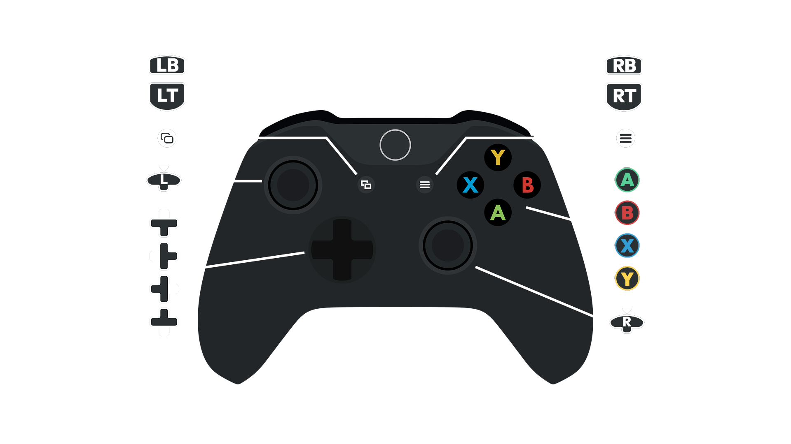

# Controls Guide

---

## ⌨️ Mouse & Keyboard:

**WASD Menu**
- You can use **WASD** in menus now.

**Change Ammo Type**
- Double tap **R**. 

**Quick Select:**
- Hold **1** to easily select **weapons**.
- Hold **2** to easily select **aid items**.

**Quick Select Throwables**
- Hold **G** to easily select **throwables**.

**B42 Bash**:
- Press **X** to **bash**.

**B42 Firemode:**

- Press **C** to change **firemode** with automatic weapons.

**Item Cards**

- Hold **Shift** to bring up **item cards** when looting.

## 🎮 Controller:

You may want to enable the **Soft-Lock Aim-Assist** mod in the **Utilities** separator in the left pane of **MO2**.

**MEW** uses a modernized control scheme that is closer to later titles like FO4.

