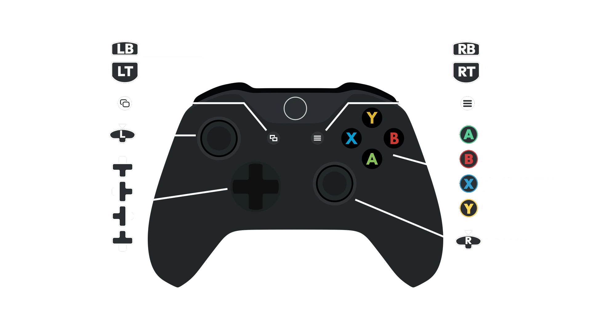

# Controls Guide

---

## ⌨️ Mouse & Keyboard:

**WASD Menu**
- You can use **WASD** to navigate menus now.

**Change Ammo Type**
- Double tap **R**.

**Change Shoulder Camera**

- Press **F** or **Middle Mouse Button** whilst **aiming** to change shoulder camera view.

**Realtime PipBoy Map**

- Hold **Q** to bring the map up.

- Mouse Scroll **Up/Down** to zoom in/out on the map.

- Press **Middle Mouse Button** to change map mode.

**B42 Bash**:
- Press **X** to **bash**.

**B42 Firemode:**

- Press **C** to change **firemode** with automatic weapons.

**B42 Scopes:**

- Use the **Scroll Wheel** to adjust **zoom** and **TAB** to adjust **night vision** on supported scopes.

**Hold Breath**

- Hold **L-ALT** to hold your breath whilst scoped.

**Open Map**

- Press **M** to open the pip-boy world map quicky.

---

## 🎮 Controller:

You may want to enable the **Soft-Lock Aim-Assist** mod in the **Utilities** separator in the left pane of **MO2**.

**MEW** uses a modernized control scheme that is closer to later titles like FO4.

