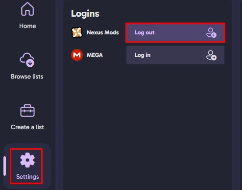

# FAQ

---

If your issues still aren't fixed then please join the the [Mojave Express Wabbajack](https://discord.gg/SFpZYpAuUz) discord server for support.

  
**Wabbajack Installation Failed**

- Ensure that you have **all** of the **DLCs** installed for the game!

- Ensure that the game is set to **English** on Steam or GOG!

- Log out of Nexus on Wabbajack and log back in, then try to install **MEW** again. (You may get blocked for 10 minutes but just wait and try again.)

    

**Game Crashes Or Fails To Start**

The **most common** reason is below:

- Make sure you did the [**Root Mods**](/docs/Installation#root-mods) step properly and you ran **FNVpatch.exe**. (Even if you are a GOG user.)

- Make sure the latest VC++ Redistributables below are installed:
    - [**VC++ AIO**](https://www.techpowerup.com/download/visual-c-redistributable-runtime-package-all-in-one/)
        - Extract the archive and run the included `install_all.bat` as an administrator.
    - [**2015-2022 X64**](https://aka.ms/vs/17/release/vc_redist.x64.exe) - Run the .exe
    - [**2015-2022 X86**](https://aka.ms/vs/17/release/vc_redist.x86.exe) - Run the .exe
    - Restart your PC.

---

<h3> Make sure that DirectX Redistributables are installed and functional:</h3>
1. Download the [**DirectX Redists Remover Script**](https://vivanewvegas.moddinglinked.com/files/DirectX%20Remover.7z) and unpack it.
2. Run the script as an administrator.
3. Restart your PC.
4. Download the [**DirectX Redists Web Installer**](https://www.microsoft.com/en-in/download/details.aspx?id=35) and run it.
    - The installer will try to install **Bing Bar** by default! Remember to uncheck it on the second page.
5. Restart your PC.

---

<h3> Miscellaneous: </h3>

- [**Base Address Randomization**](/docs/Requirements#disabling-base-address-randomization) is enabled. This has to be disabled for a modded game to work!
- You have incompatible mods lingering in your game's Data folder, this is why a clean slate is required.
- If you are using an AMD GPU, make sure that your drivers are updated to the [**latest version**](https://www.amd.com/en/support)!
- If you are using a third-party antivirus, add exclusions to the folder Mod Organizer 2 is in. If that doesn't work, try disabling the antivirus completely and rely solely on Windows Defender (which should work fine once exclusions are present).
- Close or uninstall Overwolf.
- Most programs that ship with pre-built computers or laptops (such as OMEN Gaming Hub for HP OMEN systems) will be prone to issues and should be uninstalled or temporarily closed.
- Lock your FPS below **120** according to the [**Performance Guide**](https://performance.moddinglinked.com/falloutnv.html#RecommendedLimiters).

**Application Load Error**

- **5:0000065434:** Make sure **Steam** is running. If that doesn't fix it, run your game directly through Steam once. You may also need to restart Steam and/or Mod Organizer 2. If that still doesn't work, place a copy of your Steam.exe (not a shortcut) into the game's **Root folder**.

- **P:0000065432:** This might be related to the PCR release of the game. **Override the Steamapp ID** with MO2's executable settings and set it to `22490`.

    

**Bouncing NPCs Or Sped-up Game**

- **Lock your FPS** below **120** according to the Performance Guide. 

**Missing Meshes (Red Diamonds)**

- Verify your game files.

    - You will need to reapply the 4GB Patcher and re-run the BSA Decompressor and after doing this.

**General Answers**

- You will **need** to start a new Save after installing **MEW**!

