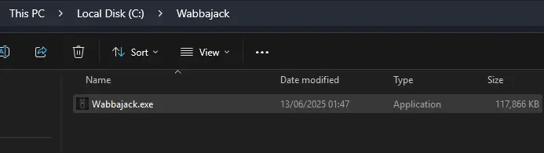
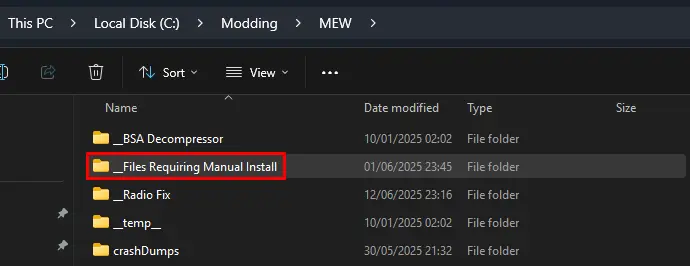
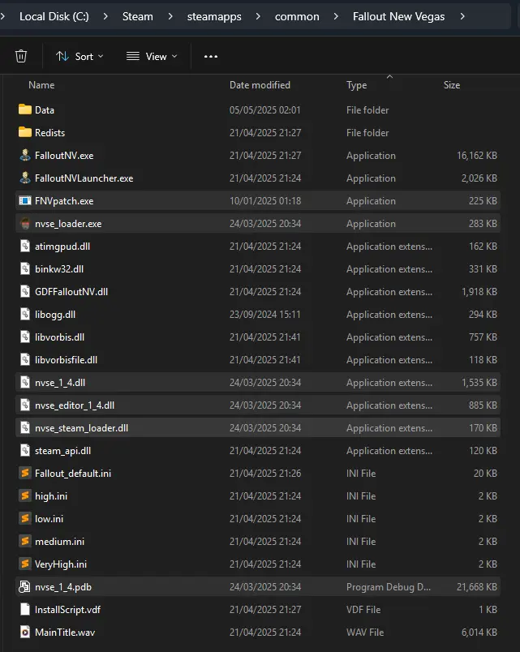
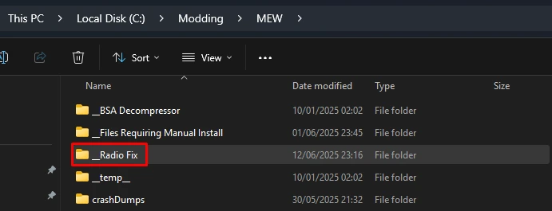
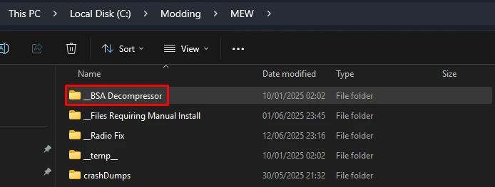

# Installation

---

:::danger Wabbajack is currently not showing on the Wabbajack software!

Right now i'm waiting for my pull request to be merged so MEW will show on the Wabbajack. But for now you can download the file from my [**discord**](https://discord.gg/SFpZYpAuUz) in the announcements channel.

:::

## Installation Steps

1. Download the latest [Wabbajack](https://www.wabbajack.org/).
2. **Create a new folder** anywhere outside of any default Windows folders, and the game folder itself.
    - Example: `C:\Modding\Wabbajack`
3. Place the downloaded **Wabbajack.exe** in this folder, then run it.

4. Click the **Settings** button in the bottom left and then **Log In** to Nexus Mods. 
5. Once logged in, on the left side click **Browse lists**, select **Non-featured** then search **MEW** at the top 
6. Select **MEW** and click the **Download & Install** ⭳ button in the bottom left corner. 
7. Once downloaded, under the **Installation Location** select an **empty folder**. 
    - Example: `C:\Modding\MEW`

:::danger It cannot be in the below folders:
    - The Steam folder,
    - Any default Windows folders,
    - The game folder,
    - The folder where you put Wabbajack.exe.
:::
    
1. Click the **Install** button in the bottom right.
2. Accept the Nexus Mods API request. 
3. If you are not a Nexus Premium user you will need to manually click download for each mod. 
    - Once complete, the installation will say **Finished installing Mojave Express Wabbajack** at the top of the screen.
4. If you see a **Installation Failed** screen, Read the [**FAQ**](/docs/FAQ) **Wabbajack Installation Failed** section. 
    - If that doesn't work please join the [Mojave Express Wabbajack](https://discord.gg/SFpZYpAuUz) server for support.

---

## Post-Installation Steps

### Exclusions:

This operation is required because Windows can block MO2 and mod files from loading due to how MO2's virtualized filesystem works.

1. Open <button onClick={() => window.location.href = 'ms-settings:windowsdefender'}> Windows Security </button>
2. Open **Virus & threat protection**.
3. Click **Manage settings** under Virus & threat protection settings.
4. Scroll down and click **Add or remove exclusions** under Exclusions.
5. Add a Folder exclusion and point it to the **Installation Location** folder.
    - Example: `C:\Modding\MEW`

- If you are using a third-party antivirus, you will need to find the exclusions menu and add one to the same folder.

### Root Mods:

1. In your **Installation Location**, open the **__Files Requiring Manual Install** folder.

2. Copy **everything** inside to the game's **Root folder**.

3. Still in the game's Root folder, double-click on **FNVpatch.exe** to run it.
4. A command prompt window will open and it should say:
    `FalloutNV.exe patched!`
5. Close the command prompt and a file named **FalloutNV_backup.exe** should appear in the same folder.

### Radio Fix:

1. In your **Installation Location**, open the **__Radio Fix** folder.

2. Double-click on **Run This.bat**.
3. A command prompt window will open and start encoding files.
4. Once its finished it will say `Radio Fix has been successfully installed!`

### BSA Decompressor:
Decompresses the vanilla BSA files to reduce loading times and stuttering. Can also fix certain sound effects not playing.

1. In your **Installation Location**, open the **__BSA Decompressor** folder. 
2. Double-click on **FNV BSA Decompressor.exe**.

3. The Fallout: New Vegas and Decompressed Archives paths should be filled by default (Root folder and Data folder respectively).
        - If they aren't, close the program and re-run your game launcher to generate the required registry key.
5. Click **Decompress**, wait for the process the finish, then exit the program once finished.
