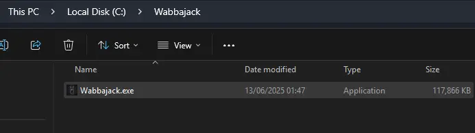
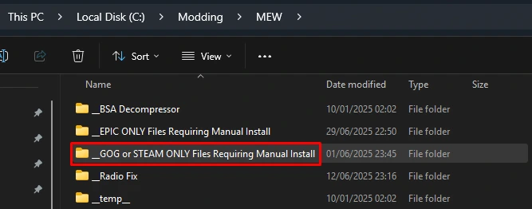
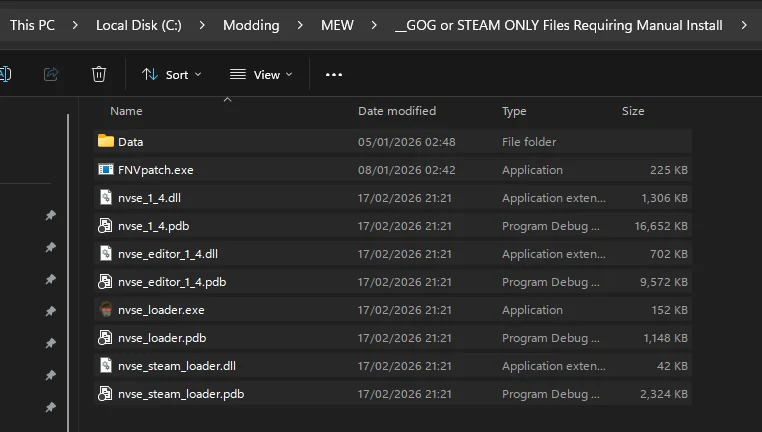
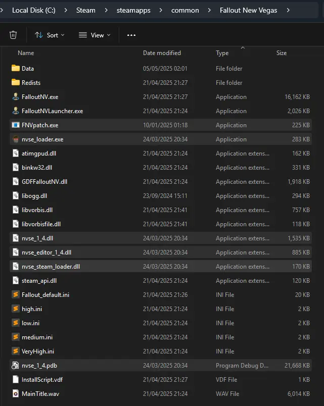
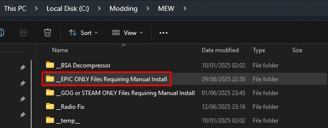
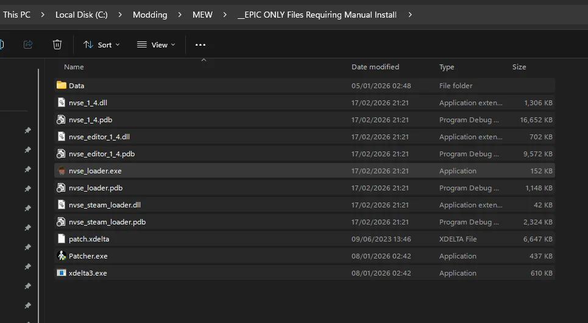
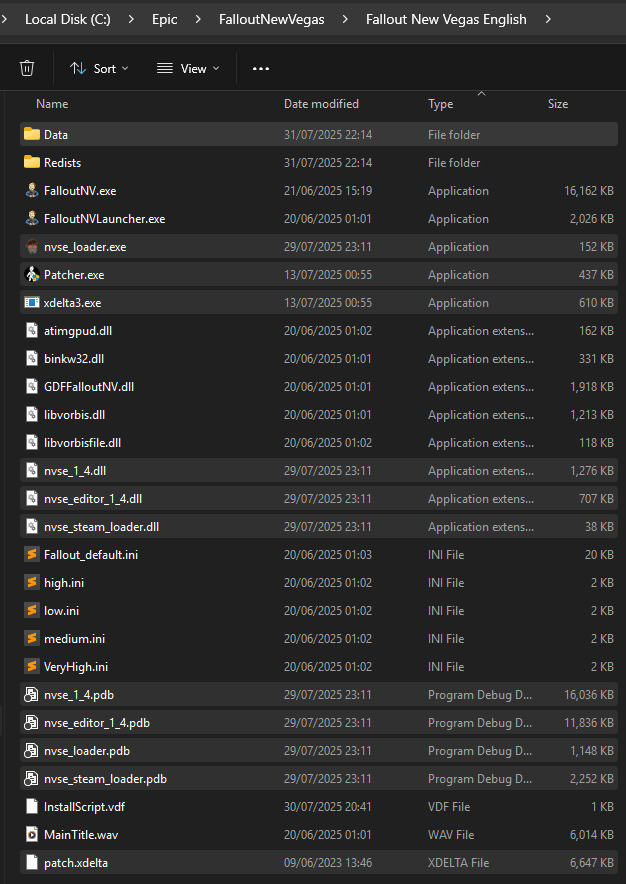

# Installation

---

## Installation Steps

1. Download the latest [Wabbajack](https://www.wabbajack.org/).
2. **Create a new folder** anywhere outside of any default Windows folders, and the game folder itself.
    - Example: `C:\Modding\Wabbajack`
3. Place the downloaded **Wabbajack.exe** in this folder, then run it.

4. Click the **Settings** button in the bottom left and then **Log In** to Nexus Mods. 
5. Once logged in, on the left side click **Browse lists**, select **Non-featured** then search **MEW** at the top 
6. Select **MEW** and click the **Download & Install** ⭳ button in the bottom left corner. 
7. Once downloaded, under the **Installation Location** select an **empty folder**. 
    - Example: `C:\Modding\MEW`

:::danger It cannot be in the below folders:
    - The Steam folder,
    - Any default Windows folders,
    - The game folder,
    - The folder where you put Wabbajack.exe.
:::
    
1. Click the **Install** button in the bottom right.
2. Accept the Nexus Mods API request. 
3. If you are not a Nexus Premium user you will need to manually click download for each mod. 
    - Once complete, the installation will say **Finished installing Mojave Express Wabbajack** at the top of the screen.
4. If you see a **Installation Failed** screen, Read the [**FAQ**](/docs/FAQ) **Wabbajack Installation Failed** section. 
    - If that doesn't work please join the [Mojave Express Wabbajack](https://discord.gg/SFpZYpAuUz) server for support.

---

## Post-Installation Steps

### Exclusions:

This operation is required because Windows can block **MO2** and mod files from loading due to how MO2's virtualized filesystem works.

1. Open <button onClick={() => window.location.href = 'ms-settings:windowsdefender'}> Windows Security </button>
2. Open **Virus & threat protection**.
3. Click **Manage settings** under Virus & threat protection settings.
4. Scroll down and click **Add or remove exclusions** under Exclusions.
5. Add a Folder exclusion and point it to the **Installation Location** folder.
    - Example: `C:\Modding\MEW`

- If you are using a third-party antivirus, you will need to find the exclusions menu and add one to the same folder.

---

### Root Mods:

:::danger This step is mandatory! Failure to do this will result in your game crashing!
:::

**GOG or Steam Only**

1. In your **Installation Location**, open the **__GOG or STEAM ONLY Files Requiring Manual Install** folder.

2. Copy **everything** inside the folder.

3. Navigate to the game's **Root folder** and paste the copied contents inside.

4. Still in the game's Root folder, double-click on **FNVpatch.exe** to run it.
5. A command prompt window will open and it should say:
    `FalloutNV.exe patched!`
6. Close the command prompt and a file named **FalloutNV_backup.exe** should appear in the same folder.

**Epic Games Only**

1. In your **Installation Location**, open the **__EPIC ONLY Files Requiring Manual Install** folder.

2. Copy **everything** inside the folder.

3. Navigate to the game's **Root folder** and paste the copied contents inside.

4. Still in the game's Root folder, double-click on **Patcher.exe** to run it   .
5. A command prompt window will open and it should say:
    `FalloutNV.exe patched!`
6. Close the command prompt and a file named **FalloutNV_backup.exe** should appear in the same folder.

