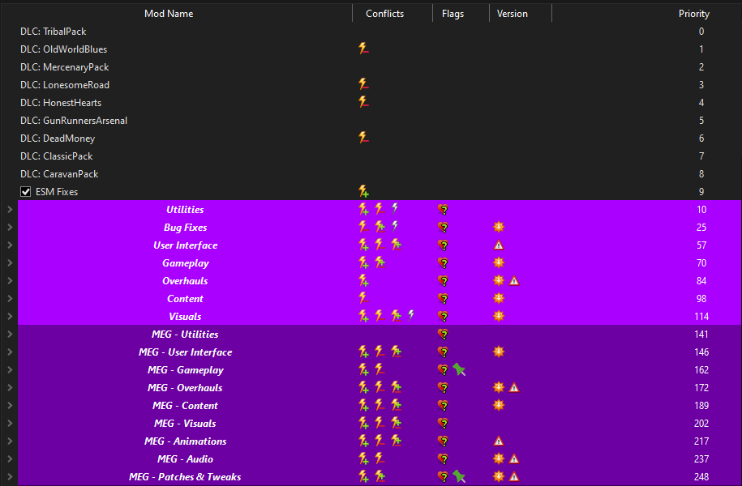

# MEG - Utilities
 
---

:::info Instruction:

As you did with **Viva New Vegas** you will now need to create new separators for the above categories. Create the seperator **MEG - Utilities** and place it below the **Visuals** seperator previously created for **VNV**. Below is an example of how the separators will look once you have completed the guide.

:::

### [SUP NVSE](https://www.nexusmods.com/newvegas/mods/73160)

NVSE plugin which adds new functions and allows modders to easily add new UI elements to the game.

**Installation:**

- **Main Files - SUP NVSE Plugin**

### [AnhNVSE](https://www.nexusmods.com/newvegas/mods/74012)

Another script extender plugin.

**Installation:**

- **Main Files - AnhNVSE v1.3.1**

### [HIPControl](https://www.nexusmods.com/newvegas/mods/81967)

Allows you to easily adjust weapon idle/hipfire position on screen!

**Installation:**

- **Main Files - HIPControl**

### [Weapon Based fNearDistance ESPLess](https://www.nexusmods.com/newvegas/mods/82093)

Allows you to set the custom fNearDistance based on a weapon to remove the clipping. ESPLess.

**Installation:**

- **Main Files - Weapon Based fNearDistance ESPLess**

### [Sound Extender](https://www.nexusmods.com/newvegas/mods/78637)

An xNVSE engine plugin that adds support for dedicated interior/exterior weapon sounds, per-material collision sounds for bullet casings, and per-form collision sounds. 

**Installation:**

- **Main Files - Sound Extender**