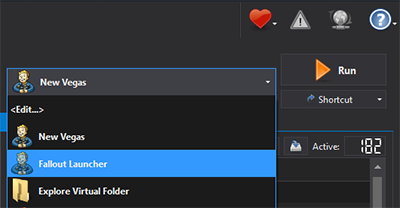
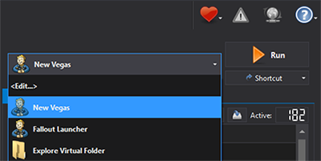

# Mod Organizer 2

---

### Mod Organizer 2 Setup:

1. Go to your **Installation Location** and launch **ModOrganizer.exe**.
2. If you see a pop-up called **FalloutNV_lang.esp was found**, select **Yes**.
3. If you see a pop-up called **Register?**, select **Yes**.

### Configuring Game Settings:

Open the game launcher using the **Fallout Launcher** option in MO2.

Inside the launcher, click Options and do the following:
- Select **Ultra Preset**.
    - If you have a very weak PC, you can select **Medium Preset** instead.
- Set **Resolution** to your monitor's native resolution. 

<h4>If you can't find the right resolution in the launcher's list, do the following:</h4>

Close the launcher.
Click the  button at the top of MO2 and select **INI Editor**.
Select the **FalloutPrefs.ini** tab.
Change the following settings in the **Display** section:
    - **`iSize W`** = your screen width
    - **`iSize H`** = your screen height

Close the launcher.

### Launching The Game:

You will need to launch the game through **MO2** everytime you intend to play the game.
- For convenience you can also create a **Shortcut** (right below the **Run** button) so that you won't have to manually open MO2 each time before playing.

### Testing Utilities:

1. Once the game has reached the main menu, wait a few seconds and you will see a message box from the **Utilities Checker**. 
    - If any check fails and the comment doesn't help you find a solution, open a support thread in the [Mojave Express Wabbajack](https://discord.gg/SFpZYpAuUz) discord server. 
2. Close the game and disable the **ML Utilities Checker** under the Utilities separator (left pane).

:::tip You have now successfully installed the Mojave Express Wabbajack list. You can now start playing!

It is highly recommended to follow the [**Performance & Optimization**](/docs/Performance) step next! You can additionally check out the **Useful Information**, **Configuration & Tweaks**, and **Controls Guide** as well.

:::

- If anything fails please check out the FAQ page!

