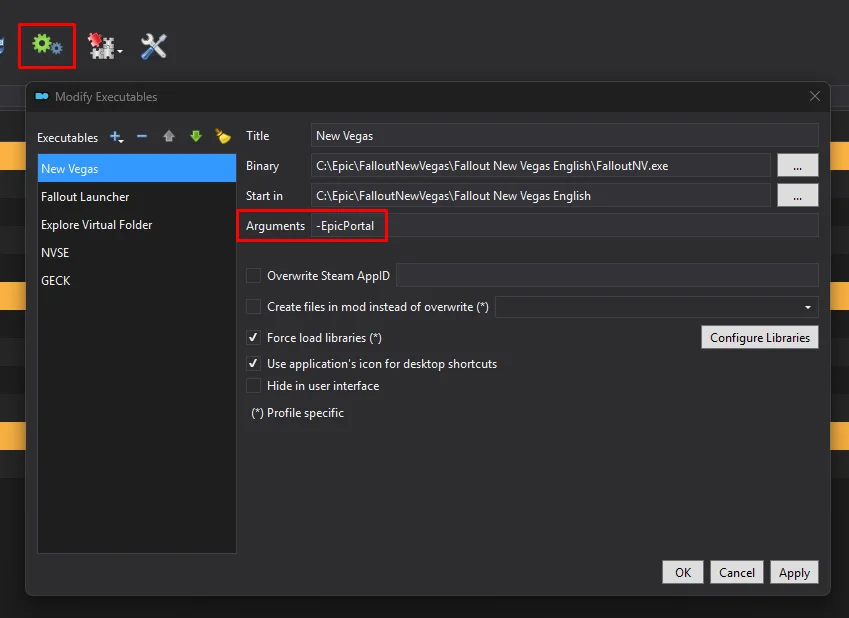
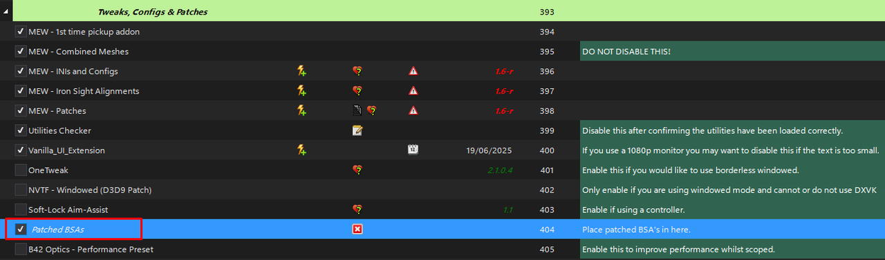
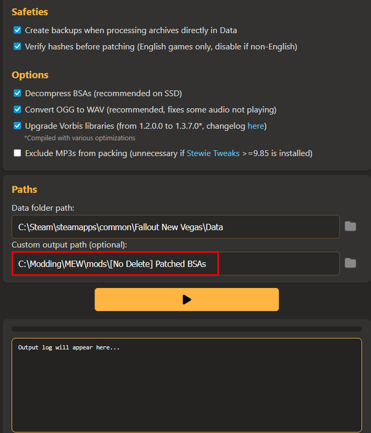
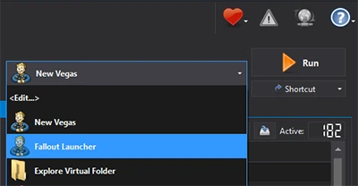
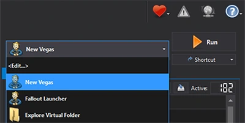

# Mod Organizer 2

---

### Mod Organizer 2 Setup:

1. Go to your **Installation Location** and launch **ModOrganizer.exe**.
2. If you see a pop-up called **FalloutNV_lang.esp was found**, select **Yes**.
3. If you see a pop-up called **Register?**, select **Yes**.

**Epic Games Only Step**

1. Select the **Modify Executables** icon in the top left of **MO2**.
2. Select **New Vegas** and add <b>-EpicPortal</b> in the Arguments section, press apply and ok.

3. Repeat this for the **Fallout Launcher** executable underneath.

---

### Vanilla BSAs Patcher:
Decompresses archives for better loading time and fixes vanilla audio not playing.

**BSA Patcher Step**

1. In **MO2**, open the **Tweaks, Configs & Patches** separator and find the mod **[No Delete] Patched BSAs** at the bottom.

2. Right click the mod and select **Open in Explorer**
3. Copy the **file path** at the top of your Windows Explorer
4. In your **Installation Location**, open the **___Vanilla BSAs Patcher** folder. 
5. Double-click on **Vanilla BSAs Patcher.exe**.
6. In the **Custom output path** paste the file path you copied from earlier.

7. Press the ► button and wait for the process the finish, then exit the program once finished.

---

### Configuring Game Settings:

1. Select the **Fallout Launcher** option in MO2 and click **Run**.
    

2. Inside the launcher, click Options and do the following:
    - Select **Ultra Preset**.
        - If you have a very weak PC, you can select **Medium Preset** instead.
    - Set **Resolution** to your monitor's native resolution. 
    

    

    
**If you can't find the right resolution in the launcher's list, do the following:**

    Close the New Vegas Launcher.
    Click the  button at the top of MO2 and select **INI Editor**.
    Select the **FalloutPrefs.ini** tab.
    Change the following settings in the **Display** section:
        - **`iSize W`** = your screen width
        - **`iSize H`** = your screen height
    

3. Close the New Vegas Launcher.

---

### Launching The Game:

You will need to launch the game through **MO2** everytime you intend to play the game.
- For convenience you can also create a **Shortcut** (right below the **Run** button) so that you won't have to manually open MO2 each time before playing.

---

### Testing Utilities:

1. Once the game has reached the main menu, wait a few seconds and you will see a message box from the **Utilities Checker**. 
    - If any check fails and the comment doesn't help you find a solution, open a support thread in the [Mojave Express Wabbajack](https://discord.gg/5bH7Kd49hx) discord server. 
2. Close the game and disable the **Utilities Checker** under the Tweaks, Configs & Patches separator (left pane).

:::tip You have now successfully installed the Mojave Express Wabbajack list.

Please follow the [**Performance & Optimization**](/docs/Performance) step next to solve Alt-Tab and performance issues!

:::

- If anything fails please check out the [**FAQ**](/docs/FAQ) page!

