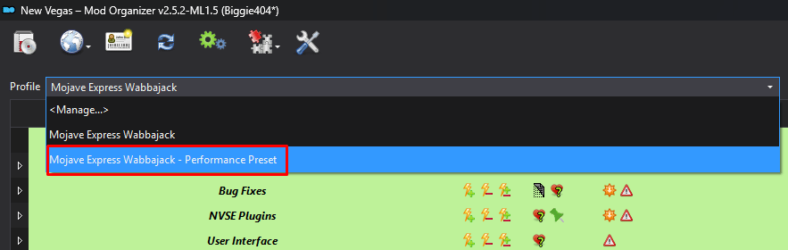

# Performance & Optimization

---

It is highly recommended to read the [performance guide](https://performance.moddinglinked.com/falloutnv.html) as this is an in-depth guide on how to fix the game's lackluster performance, display issues and alt-tabbing. Covers topics such as DXVK, framerate limiting, display modes, lag and HDR. 

### FPS Limiting:

It is extremely important that your fps is capped to **120 or less**. At framerates higher than this you can expect some weirdness but more importantly this can cause **crashes!** Read [Recommended Limiters](https://performance.moddinglinked.com/falloutnv.html#RecommendedLimiters) for more information.

### DXVK:

In general, on most modern CPUs you can expect performance improvements by using [DXVK](https://www.nexusmods.com/newvegas/mods/79299). You will need to read the [**DXVK section**](https://performance.moddinglinked.com/falloutnv.html#DXVK) of the performance guide, as the install and configuration depends entirely on your hardware.

### MO2 Performance Profile:

You can select the **Mojave Express Wabbajack - Performance Preset** if you need some extra fps.

 

**This preset does the following:**
- Disabled the Vanilla Plus AO mod 
- Disables the Vanilla Terrain Parallaxed mod
- Disables the Vanilla Objects Parallaxed mod
- Disables the Weapon blur and DOF effects mod
- Disables the Afterglow mod
- Disables NPC shadows
- For B42 Optics - Reduces the resolution of the scope and removes DOF