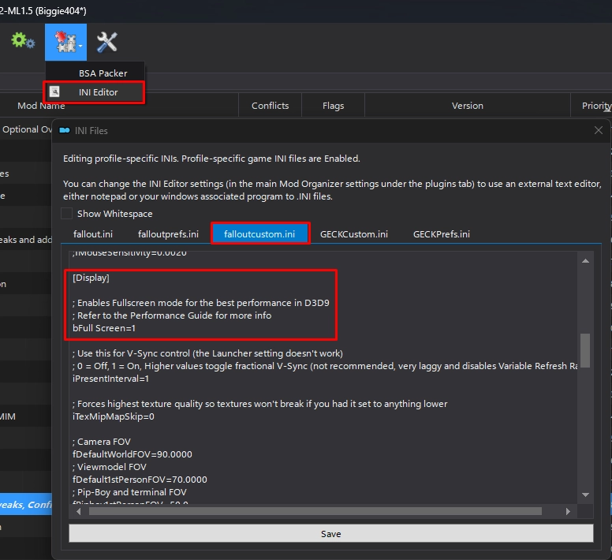

# Performance & Optimisation

---

### Fixing Alt-Tab:

:::warning Important

By default you will not be able to Alt-Tab in **Fullscreen Mode**! In order to solve this you either need to install **DXVK** and/or run the game in **Windowed Mode**.

:::

In general, you should try to install **DXVK** as it will fix your Alt-Tabbing issues and typically improves performance. However, the installation and compatiblity depends entirely on your hardware. Read [DXVK](https://performance.moddinglinked.com/falloutnv.html#DXVK) for more information including installation and configuration. 

**If you are not able to use DXVK!**

In this case you will need to run the game in windowed mode. The below steps will give you the optimal experience: 

1. Go into **falloutcustom.ini** and change **bFull Screen** to **`0`**

2. Enable the **OneTweak** mod in the left pane of MO2 under the **Tweaks, Configs & Patches** separator.
3. Enable the **NVTF - Windowed (D3D9 Patch)** mod in the left pane of MO2 under the **Tweaks, Configs & Patches** separator.

---

### FPS Limiting:

It is extremely important that your fps is capped to **120 or less**. At framerates higher than this you can expect some weirdness but more importantly this can cause **crashes!** Read [Recommended Limiters](https://performance.moddinglinked.com/falloutnv.html#RecommendedLimiters) for more information.

---

### MO2 Performance Profile:

You can select the **Mojave Express Wabbajack - Performance Preset** if you need some extra fps.

 

**This preset does the following:**
- Disables the Vanilla Plus AO mod 
- Disables the Vanilla Terrain Parallaxed mod
- Disables the Vanilla Objects Parallaxed mod
- Disables the Weapon blur and DOF effects mod
- Disables the Afterglow mod
- Disables NPC shadows
- For B42 Optics - Reduces the resolution of the scope and removes DOF
- Slightly reduces various LOD distances
