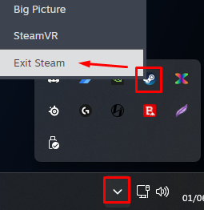
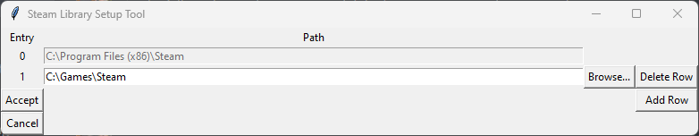
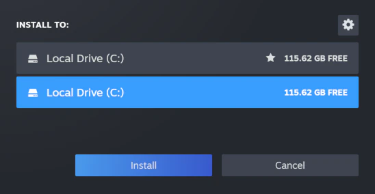

# Pre-installation

---

## Choosing a location:

A **clean game installation** is <b> mandatory </b>  to get rid of any potential leftover mod files and ensure the game is installed in a safe location. Here is what you need to know when choosing where to install your game:

    Avoid any default Windows folders: This includes but is not limited to `C:\Program Files`, `C:\Program Files x86`, your `Desktop` and your `Documents` folders.
    This is because users lack write access to Program Files, while Desktop and Documents are often managed by OneDrive. This can cause many issues with the game and any modding tools.

    An example of a safe location is `C:\Games`

    - **Install on an SSD** if possible as this will drastically improve loading times and decrease stuttering.

## Uninstalling the game:

:::tip Note:

If you never installed the game before, go directly to the **Installing the game** section. 

:::

As the game is available on **Steam or GOG** there are separate instructions for both. Pick the one that is suitable for you.

  
<h2>Steam</h2>

1. Open Steam and go to your **Library**.
2. Find **Fallout: New Vegas** in the list.
3. Right-click on it and select **Manage** -> **Uninstall**.
4. Navigate to `Steam\steamapps\common` and, if present, delete the Fallout New Vegas folder.
5. Navigate to `Documents\My Games\FalloutNV` and delete all INI files inside it.

  
<h2>GOG</h2>

1. Open GOG and go to your **Library**.
2. Find **Fallout: New Vegas** in the list.
3. Right-click on it and select **Manage Installation** -> **Uninstall**.
    - If you used an offline installer then run the **unins000.exe** file in the game's Root folder.
5. Navigate to `Documents\My Games\FalloutNV` and delete all INI files inside it.

## Installing the game

:::danger Warning:

It is strongly recommended to install the game outside of any default Windows folders (such as `Program Files (x86)`), as the strict Windows file protections of these folders can break certain mods/tools. 

:::

  
<h2>Steam</h2>

In order to install the game outside of `Program Files (x86)` we will use a tool called **Steam Library Setup Tool** to create a **new Steam library folder** outside of any default Windows folders.

If you already have Steam installed outside of any default windows folders then go directly to step 1 of the next section and install the games to your custom Steam library. 

1. Completely exit out of Steam using Task Manager or System Tray.

  

2. Download the **steam_library_setup_tool-3.2.exe** file from [here](https://github.com/LostDragonist/steam-library-setup-tool/releases).
3. Once downloaded, run the file and add a new entry by clicking **Add Row**.
4. Type the chosen path under **Path**, e.g. `C:\Games\Steam`
5. Click **Accept** then **Yes**  if prompted to create a new folder.
6. The tool will ask to exit, select **OK** .

1. Open Steam and go to your **Library**.
2. Find **Fallout: New Vegas** in the list and select **Install**.
3. Select the library folder created with the tool, which will be the **second** C:\ entry if you are installing on the main drive.

4. Select **Next** then wait for the install to finish.
- **If you still do not see your new library, restart your PC.**

  
<h2>GOG</h2>

1. Open GOG and go to your **Library**.
2. Find **Fallout: New Vegas** in the list and select Install.
3. Set the Install to location to a location of your choice.
    - It is **required** to install the game outside of any default Windows folders (e.g., `Program Files x86`).

## Generating Fresh INI Files

1. Run the game from Steam/GOG Galaxy, or through FalloutNVLauncher.exe in the game files if you are using an offline copy.
2. Click OK to both pop-ups that say **Detecting Video Hardware**.
  - If there aren't any pop-ups, navigate to `Documents\My Games\FalloutNV` and delete all INI files, then retry.
3. Click **OK** then Exit.

## Key Terminology

Now that the game is installed, there are two folders from it that will be referred to in the guide often: 

- **Root Folder:** Where the game is installed.

  - For Steam:
    
`Steam\steamapps\common\Fallout New Vegas`

  - For GOG:
    
`GOG Galaxy\Games\Fallout New Vegas`

    (Unless you manually changed the installation path).

- **Installation Location:** Where MEW is installed.

  - For example: `C:\Modding\MEW`