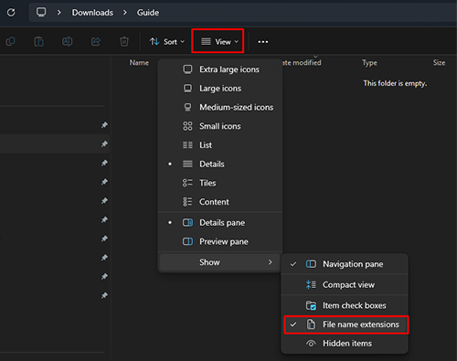
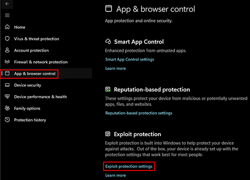
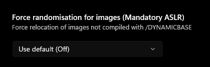

# Requirements

---

## Hardware Requirements:

The game is much more CPU-intensive than GPU-intensive, and actually scales with modern hardware pretty well. Installing the game on an SSD will drastically improve loading times and decrease stuttering. Here are the recommended specs for being able to run MEW at 60 FPS at 1080p:

:::info Hardware

- **CPU:** Any quad-core processor (2.5GHz or more).
- **RAM:** 8GB or more.
- **GPU:** Matching or surpassing the performance of NVIDIA's 600 series or AMD's 5500 series.

:::

## Software Requirements

- An **English** copy of the game with **all DLCs** from either **[Steam](https://store.steampowered.com/sub/13435/)** or **[GOG](https://www.gog.com/en/game/fallout_new_vegas_ultimate_edition)**.
    - The Microsoft Store and Epic Games versions are **not supported!**
    - Only the English version of the game is supported for maximum compatibility - translations can conflict with mods and cause issues.
    - The Polish-Czech-Russian (PCR) version of Fallout: New Vegas is fully supported as long as the game itself is in English.
    - The German release uses a "No Gore" version, making it also incompatible with xNVSE.
- At least 40GB of free drive space, game included (32GB if you delete all the downloads).
- Windows 10 or higher (64-bit). **Linux will not be supported! But it is possible if you have the know-how**

:::danger Important 

Windows installations deviating from the public release (e.g. customized or LTSC) are not supported. This is because they don't guarantee the default functionality expected from the public release, which can cause unforeseen issues.

:::

- A text editor ([Notepad++](https://notepad-plus-plus.org/) is recommended, but the default Windows notepad will work).
- An archiving tool ([NanaZip](https://apps.microsoft.com/store/detail/nanazip/9N8G7TSCL18R?hl=en-us&gl=us) is recommended).
- The latest GPU drivers (either [NVIDIA](https://www.nvidia.com/Download/index.aspx), [AMD](https://www.amd.com/en/support) or [Intel](https://www.intel.com/content/www/us/en/search.html#q=&sort=relevancy&f:@tabfilter=[Downloads]&f:@stm_10385_en=[Graphics])).
- A [Nexus Mods](https://users.nexusmods.com/register) account (a Premium subscription will allow uncapped speeds and fully automated mod downloading).

## Installing VC++ Redistributables

Most engine mods and tools require latest **Visual C++ Redistributables** to be installed. We will use an all-in-one package that will install all possible versions.

:::danger Mandatory

Failure to have latest versions installed will result in an **immediate crash** when launching the game or modding tools.

Please install the redistributables even if you have them installed already, as they are often outdated.

:::

- Download **[VC++ AIO](https://www.techpowerup.com/download/visual-c-redistributable-runtime-package-all-in-one/)** from TechPowerUp.
- Extract the archive anywhere
- After extracting run the included `install_all.bat` as an administrator.
- Restart your PC.

## Enabling File Extensions

Before we start, it is important to enable **file extensions** in Windows.

By default, File Explorer will not show file extensions (such as .exe, .dll, or .esp). These extensions are very important pre and installation, so it is highly recommended to enable visible file extensions:

1. Open File Explorer.
2. Select the **View** tab at the top.
3. Enable **File name extensions** in the Show section.

## Disabling Base Address Randomization

Base Address Randomization is a security feature in Windows that allows program's starting address to be randomized, which is not the expected behavior in 32-bit programs like Fallout: New Vegas. This **leads to crashes** in a modded game.

While the feature should be disabled by default, it is still recommended to sanity check if it is disabled:

1. Open <button onClick={() => window.location.href = 'ms-settings:windowsdefender'}> Windows Security </button> from your **Start Menu**.
2. Click on **App & browser control** in the left sidebar.
3. Click on **Exploit protection settings** under Exploit protection.

4. Ensure **Force randomization for images (Mandatory ASLR)** is set to **Use default (Off)**.

