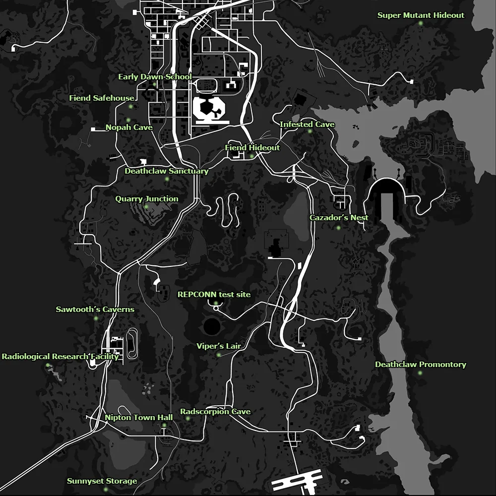

# Useful Information

---

You will not get the **Courier's Stash** DLC weapons when you start a new character due to [JSawyer Ultimate Edition](https://www.nexusmods.com/newvegas/mods/61592). Instead the items are moved to the following locations: 

- **Tribal Pack:** Lucky Jim Mine House
- **Caravan Pack:** Hell's Motel
- **Classic Pack:** Wrecked Highwayman
- **Mercenary Pack:** Bradley's Shack

---

###  New Weapons:

- **Pump-Action Shotgun** - 20ga earlygame shotgun.
- **Police Submachine Gun** - 10mm early-midgame submachine.
- **Mercenary Assault Rifle** - 5.56mm midgame assault rifle.
- **Double-Barrel Shotgun** - 12ga midgame shotgun.
- **Combat Rifle** - .308 mid-lategame sniper rifle.
- **Military Sniper Rifle** - .308 mid-lategame sniper rifle.

:::tip **Unique Relocations:**

Many unique weapons, the majority being GRA have been relocated to the below locations:

- **Bozar:** Quarry Junction
- **Sprtel-Wood 9700:** Deathclaw Promontory
- **Lucky:** Town Hall Steyn's Office
- **That Gun:** REPCONN Basement
- **Esther** Nopah Cave:
- **Embrace of the Mantis King!:** Two Skies Cave

<h3>**New Dungeons:**</h3>

- **Paciencia:** Cazador Nest 
- **Cleansing Flame:** Sawtooth Caverns
- **MF Hyperbreeder Alpha:** Radiological Research Facility
- **Medicine Stick:** Deathclaw Sanctuary
- **Li'l Devil:** Vipers' Lair
- **Nuka-Breaker:** SunnySet Storage & Maintenance
- **Gehenna:** Infested Cave
- **Sleepytyme:** Fiend Hideout
- **The Smitty Special:** Fiend Safehouse, inside the Fiend Bunker
- **Two-Step Goodbye:** Super Mutant Hideout
- **Greased Lightning:** Early Dawn School Lower Level

:::

---

- **Perks** and **traits** have been completely overhauled. You will want to look at [Perkout](https://www.nexusmods.com/newvegas/mods/80309?tab=description) before going your usual build.
- Flame weapons now utilize the **Explosives** skill instead of Energy Weapons. See [Burning Desire](https://www.nexusmods.com/newvegas/mods/91581) for more info.
- **Weapon requirements** matter significantly more now! Meeting the strength and skill requirements is important. You can expect more sway, lower attack speeds and explosives may fail or explode prematurely. See [Weapon Requirements System](https://www.nexusmods.com/newvegas/mods/69161) for more info.
- FO3-style item repair is now back. The max repair amount of items will be capped to the player's (Repair Skill * 0.6) + 40.

To turn off FO3-style item repair:

- In left pane of MO2 open the **Tweaks, Configs & Patches** separator
- Double-click **MEW - INI's and Configs**
- Click the **INI Files** tab at the top
- Find and click `nvse\plugins\jip_nvse.ini` near the bottom
- Change bEnableFO3Repair=1 to **0**
- Press `Ctrl+S` to save changes.

---

###  Difficulty Overhauls: 

 **These can all be safely disabled in the left pane of MO2 under the Difficulty Overhauls separator. ⮯** 

- [[**Reload Reloaded**]](https://www.nexusmods.com/newvegas/mods/62266) - Your agility scales your reload speed and strength scales throwing speed and distance.
- [[**Food Effect Tweaks**]](https://www.nexusmods.com/newvegas/mods/75103) - Food heals less.
- [[**Bad Touch NVSE**]](https://www.nexusmods.com/newvegas/mods/83782) - Fire burns, electricity shocks, cacti poke, and more!
- [[**RAD - Overhaul**]](https://www.nexusmods.com/newvegas/mods/71541) - Radiation is actually dangerous, reducing your HP and AP (in hardcore mode) like FO4.
- [[**Ghouls Inflict Radiation Damage**]](https://www.nexusmods.com/newvegas/mods/77401) - Ghouls, Centaurs, Spore Carriers, Tunnelers, Mantis, Radroaches, and Molerats inflict radiation damage.
- [[**Enhanced Creatures**]](https://www.nexusmods.com/newvegas/mods/92824) - Enhances creatures in multiple ways making them significantly more difficult.
- [[**NPC Combat Dodge**]](https://www.nexusmods.com/newvegas/mods/94702) - Allows NPC's to dodge when being aimed at.
- [[**Water Depth Radiation**]](https://www.nexusmods.com/newvegas/mods/89347) - Water radiation is ramped up based upon depth.
- [[**Famine**]](https://www.nexusmods.com/newvegas/mods/74985) - Loot is rarer and weapons & armour have lower conditions when found.
- [[**Harder Barter Faster Stronger**]](https://www.nexusmods.com/newvegas/mods/80360) - The barter skill matters significantly more for buying and selling prices.
- [[**STALKER Barter**]](https://www.nexusmods.com/newvegas/mods/92340) - You can no longer sell weapons & armour under 30% condition.
- [[**Balanced Discounts and Barter Fixes**]](https://www.nexusmods.com/newvegas/mods/90644) - Reduces the economy-breaking discounts
- [[**Simple Harder Credit Check and Passport**]](https://www.nexusmods.com/newvegas/mods/90465) - The Strip is more difficult to get into and costs 4000 caps the direct way now.
- [[**Skill Based Pickpocketing**]](https://www.nexusmods.com/newvegas/mods/92546) - NPCs can't be pickpocketed at all unless you invest into the Sneak skill.
- [[**Corpse Looting Restrictions**]](https://www.nexusmods.com/newvegas/mods/94065) - Adds restrictions to looting corpses, NPCs will attack if you loot their fallen allies.

