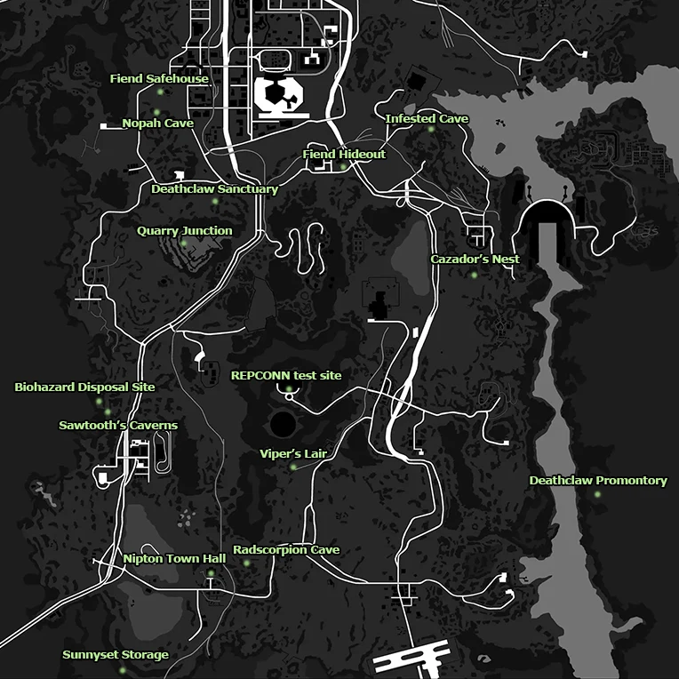

# Useful Information

---

You will not get the **Courier's Stash** DLC weapons when you start a new character due to [JSawyer Ultimate Edition](https://www.nexusmods.com/newvegas/mods/61592). Instead the items are move to the following locations: 

- **Tribal Pack:** Lucky Jim Mine House
- **Caravan Pack:** Hell's Motel
- **Classic Pack:** Wrecked Highwayman
- **Mercenary Pack:** Bradley's Shack

:::tip **Unique Relocations:**

Many unique weapons, the majority being GRA have been relocated to the below locations:

- **Bozar:** Quarry Junction
- **Sprtel-Wood 9700:** Deathclaw Promontory
- **Lucky:** Town Hall Steyn's Office
- **That Gun:** REPCONN Basement
- **Esther** Nopah Cave:
- **Embrace of the Mantis King!:** Two Skies Cave

<h3>**AWOLP Dungeons:**</h3>

- **Paciencia:** Cazador Nest 
- **Cleansing Flame:** Sawtooth Caverns
- **MF Hyperbreeder AlphaB:** Biohazard Disposal Site
- **Medicine Stick:** Deathclaw Sanctuary
- **Li'l Devil:** Vipers' Lair
- **Nuka-Breaker:** SunnySet Storage & Maintenance
- **Two-step goodbye:** Radscorpion Cave
- **Gehenna:** Infested Cave
- **Sleepytyme:** Fiend Hideout
- **The Smitty Special:** Fiend Bunker

:::

---

- **Perks** and **traits** have been completely overhauled. You will want to look at [Perkout](https://www.nexusmods.com/newvegas/mods/80309?tab=description) before going your usual build.
- Flame weapons now utilize the **Explosives** skill instead of Energy Weapons. See [Burning Desire](https://www.nexusmods.com/newvegas/mods/91581) for more info.
- **Weapon requirements** matter significantly more now! You can expect more sway, slower reloads, lower attack speeds and explosives may fail or explode prematurely. See [Weapon Requirements System](https://www.nexusmods.com/newvegas/mods/69161) for more info.

###  Difficulty Overhauls: 

 **These can all be safely disabled in the left pane of MO2 under the Difficulty Overhauls separator. ⮯** 

- (**Food Effect Tweaks**) - Food heals less.
- (**Bad Touch NVSE**) - Fire burns, electricity shocks, cacti poke, and more!
- (**RAD - Overhaul**) - Radiation is actually dangerous, reducing your HP and AP (in hardcore mode) like FO4.
- (**Ghouls Inflict Radiation Damage**) - Ghouls, Centaurs, Spore Carriers, Tunnelers, Mantis, Radroaches, and Molerats inflict radiation damage.
- (**Water Depth Radiation**) - Water radiation is ramped up based upon depth.
- (**Famine**) - Loot is rarer and weapons & armour have lower conditions when found.
- (**Harder Barter Faster Stronger**) - The barter skill matters significantly more for buying and selling prices.
- (**STALKER Barter**) - You can no longer sell weapons & armour under 30% condition.
- (**Simple Harder Credit Check and Passport**) - The strip is slightly more difficult to get into and costs 4000 caps the direct way now.

